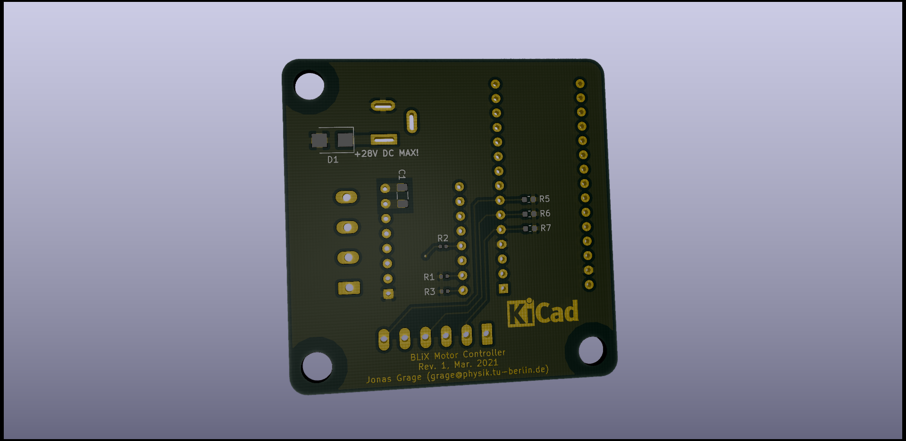
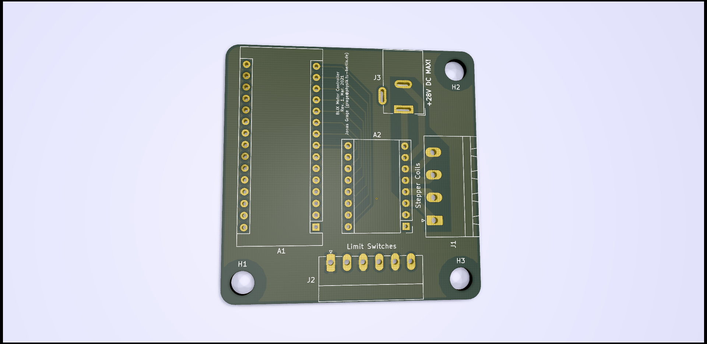
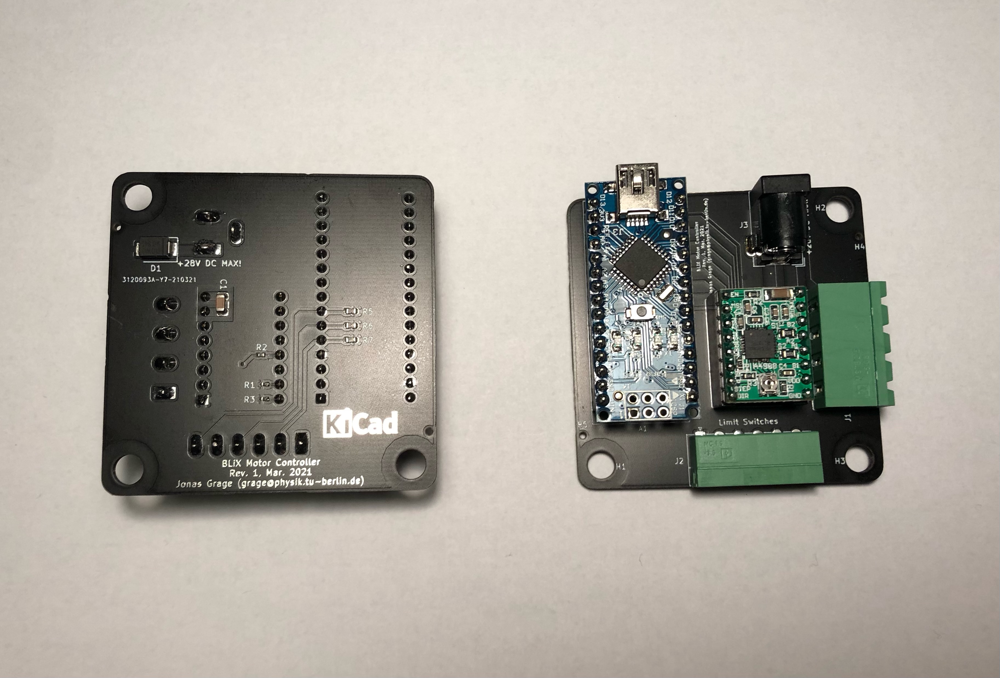

# stepper-board
Stepper motor controller board with NEMA-23 dimensions. This board was designed with KiCad. All manufacturing files are prepared for production at [JLCPCB](https://jlcpcb.com/). The surface mount components are placed on the top layer. All through-hole connectors are placed on the bottom layer. 

## Driver
The board features a socket for a Pololu [A4988 breakout board](https://www.pololu.com/product/1182). This chip can drive stepper motors with up to 2A per coil. Make sure to connect an appropriate power supply to the barrel jack.

## Controller
The firmware resides in an Arduino Nano that will plug into the 30-pin socket. Make sure to use a board with FT232RL chip so your controller will have a unique USB ID. The cheaper CH340 chips that are used on many clones all share the same ID. The controller receives serial commands and its 5V power via the Mini USB connector. 

## Limit switches
The firmware currently supports two mechanical limit switches in a normally closed configuration. Connect these to the two leftmost/rightmost pins of the 6-pin connector. The two middle pins are reserved for a mechanical reference switch, but this feature is not yet implemented in the firmware.

# Top layer

# Bottom layer

# Assembled

